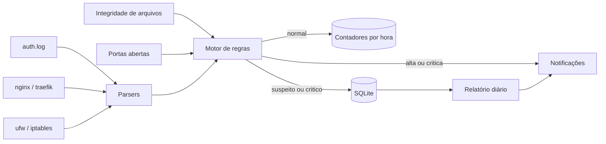

# Atalaia

[](https://github.com/Odiveighar/atalaia/actions/workflows/testes.yml)
[](LICENSE)
[](https://www.python.org/)
[](pyproject.toml)

**Monitoramento de segurança leve e open source para VPS e servidores de pequenas empresas.**

O Atalaia lê os logs do seu servidor em tempo real, classifica cada evento como `normal`, `suspeito` ou `critico` e avisa quando alguém tenta invadir. Todo dia ele entrega um relatório em português, que pode ser escrito por IA, explicando o que aconteceu e o que fazer.

Roda com cerca de 30 MB de RAM, não abre nenhuma porta e não depende de nada além do Python.

```bash
git clone https://github.com/Odiveighar/atalaia.git && cd atalaia
python3 -m atalaia analyze auth:samples/auth.log http:samples/access.log --report
```

O comando acima analisa uma invasão simulada incluída no repositório. Não instala nada e leva menos de um segundo.

> **Status:** versão 0.1, em validação aberta. Está funcionando e testado, mas ainda é jovem. Instale, quebre, reclame: todo feedback molda as próximas versões.

## Sumário

1. [Por que o Atalaia existe](#por-que-o-atalaia-existe)
2. [Como funciona](#como-funciona)
3. [O que ele detecta](#o-que-ele-detecta)
4. [Instalação](#instalação)
5. [Uso](#uso)
6. [Análise offline](#análise-offline)
7. [Agente de IA](#agente-de-ia)
8. [Notificações](#notificações)
9. [Configuração](#configuração)
10. [Escrevendo regras](#escrevendo-regras)
11. [Desempenho](#desempenho)
12. [Segurança do próprio agente](#segurança-do-próprio-agente)
13. [Perguntas frequentes](#perguntas-frequentes)
14. [Roadmap](#roadmap)
15. [Como ajudar](#como-ajudar)

## Por que o Atalaia existe

Todo servidor exposto na internet recebe centenas de tentativas de invasão por dia. Empresas grandes têm SIEM e equipe de segurança olhando. Pequenas empresas, desenvolvedores e agências que mantêm uma VPS geralmente não têm nada.

As ferramentas abertas de referência existem, mas foram feitas para outro cenário:

| | Wazuh | Security Onion | Atalaia |
|---|---|---|---|
| RAM recomendada | 4 GB ou mais | 12 GB ou mais | 30 MB |
| Instalação | Horas | Máquina dedicada | 1 comando |
| Dependências | Várias | Distribuição inteira | Nenhuma além do Python |
| Relatório legível por quem não é da área | Não | Não | Sim |

O Atalaia pega as ideias centrais das duas, as regras de host, a integridade de arquivos e o mapeamento MITRE ATT&CK do Wazuh e a visão de rede do Security Onion, e entrega em algo que cabe em uma VPS de 1 GB.

Ele **não substitui** essas ferramentas em ambiente corporativo. Ele existe para quem hoje não tem nada.

## Como funciona



1. **Coleta:** acompanha os arquivos de log como um `tail -f`, guardando a posição. Sobrevive a reinício e a rotação de logs.
2. **Normalização:** cada linha vira um evento padronizado com IP, usuário, caminho, status e demais campos.
3. **Classificação:** o evento passa pelas regras. Se nenhuma dispara, é `normal` e vira só um contador por hora, sem ocupar disco. Se dispara, é `suspeito` ou `critico` e fica gravado.
4. **Alerta:** severidade alta ou crítica gera notificação imediata, com limite contra enxurrada.
5. **Relatório:** uma vez por dia, um resumo com nível de risco e recomendações.

## O que ele detecta

| Área | Detecções |
|---|---|
| SSH | Força bruta, enumeração de usuários, login direto como root, **login com sucesso depois de força bruta**, login de origem nunca vista |
| Sistema | Criação de usuário, entrada em grupo sudo, wheel ou docker, sudo com comandos de pós exploração, falhas repetidas de sudo |
| Web | Busca por `.env` e `.git`, SQL injection, XSS, Log4Shell, path traversal, varredura de diretórios, força bruta em painel, scanners conhecidos, **arquivo sensível exposto com status 200** |
| Rede | Varredura de portas via logs do firewall, nova porta aberta para a internet |
| Integridade | Alteração em `authorized_keys`, `passwd`, `shadow`, `sudoers`, cron, serviços systemd, `sshd_config` e `ld.so.preload` |

São 23 regras, todas com técnica do MITRE ATT&CK e uma recomendação do que fazer. Liste com `atalaia rules` ou leia em [`atalaia/rules/default.json`](atalaia/rules/default.json).

### Como ele reduz falso positivo

1. **Aprendizado:** nas primeiras 24 horas, regras do tipo "nunca visto" apenas aprendem o que é normal no servidor.
2. **Agrupamento:** um scanner que dispara 500 vezes gera 1 alerta com contador 500.
3. **Limite de mensagens:** no máximo 10 notificações a cada 5 minutos.
4. **Ajuste sem código:** whitelist de IPs e faixas, desligar regras e mudar limites direto na configuração.

## Instalação

Requisitos: Linux com systemd, Python 3.9 ou superior e acesso root.

```bash
git clone https://github.com/Odiveighar/atalaia.git
cd atalaia
sudo bash deploy/install.sh
```

O instalador copia o agente para `/opt/atalaia`, cria a configuração em `/etc/atalaia/config.json`, registra o serviço no systemd com limite de 96 MB de RAM e 20% de CPU, inicia o monitoramento e roda uma verificação.

Para remover: `sudo bash deploy/uninstall.sh`. Configuração e dados são mantidos.

### Traefik em Docker ou Docker Swarm

O Traefik manda o access log para o stdout por padrão. Grave em arquivo para o Atalaia ler:

```yaml
command:
  - "--accesslog=true"
  - "--accesslog.filepath=/var/log/traefik/access.log"
volumes:
  - /var/log/traefik:/var/log/traefik
```

### Sistemas sem auth.log

Algumas distribuições recentes guardam logs só no journald. Instale o rsyslog:

```bash
sudo apt install -y rsyslog
```

## Uso

```bash
atalaia check          # valida configuracao, fontes de log e chave da IA
atalaia status         # resumo das ultimas 24 horas
atalaia alerts         # alertas recentes
atalaia alerts --min alta --hours 48
atalaia report         # gera o relatorio agora
atalaia report --send  # gera e envia nos canais configurados
atalaia rules          # lista regras e se estao ativas
atalaia test-notify    # testa os canais de notificacao
journalctl -u atalaia -f
```

## Análise offline

Analisa arquivos de log de qualquer servidor **sem instalar nada nele**. Útil para investigar um incidente que já aconteceu ou avaliar um servidor antes de instalar o agente.

```bash
python3 -m atalaia analyze auth:auth.log http:access.log firewall:ufw.log --report
```

Formato dos argumentos: `tipo:caminho`, com os tipos `auth`, `http` e `firewall`.

Saída real com os logs de exemplo do repositório:

```
Eventos: 10 normais, 5 suspeitos, 1 criticos

24/09 03:14:40  CRITICA  SSH-004  x1    203.0.113.10    Login SSH com sucesso apos forca bruta
    Login SSH aceito (password) para root vindo de 203.0.113.10
24/09 03:12:14  ALTA     SSH-001  x8    203.0.113.10    Forca bruta SSH
    Falha de login SSH para root vindo de 203.0.113.10
24/09 03:15:02  ALTA     SYS-001  x1    -               Novo usuario criado no sistema
    Novo usuario criado no sistema: suporte
24/09 03:15:05  ALTA     SYS-002  x1    -               Usuario adicionado a grupo privilegiado
    Usuario suporte adicionado ao grupo sudo
```

O atacante tentou senhas, entrou como root, criou um usuário para manter acesso e deu sudo para ele. O Atalaia reconstruiu a cadeia inteira.

## Agente de IA

Opcional. Com a IA ativada, o Atalaia:

1. **Escreve o relatório diário** com resumo executivo, nível de risco, incidentes em ordem de gravidade, prováveis falsos positivos com o ajuste sugerido e até 5 recomendações com o comando exato.
2. **Explica alertas críticos na hora**, em até 4 linhas, junto com a notificação.

A IA **nunca recebe logs brutos**, apenas o resumo agregado do período. Sem IA, o relatório continua sendo gerado em formato objetivo: o Atalaia nunca depende de serviço externo para funcionar.

Para ativar, coloque sua chave da API da Anthropic em `/etc/atalaia/env`, defina `"enabled": true` na seção `ai` do `config.json` e reinicie:

```bash
sudo systemctl restart atalaia
atalaia check
```

## Notificações

Configure na seção `notify`. Todos são opcionais e podem ser usados juntos.

| Canal | Campos |
|---|---|
| Telegram | `bot_token`, `chat_id` |
| WhatsApp via Evolution API | `url`, `instance`, `apikey`, `number` |
| Webhook | `url`, recebe JSON com o alerta completo |

O webhook permite integrar com qualquer sistema: Discord, Slack, ntfy, seu próprio painel.

Exemplo de alerta:

```
[ATALAIA] ALERTA CRITICA
Servidor: minha-vps
Regra: SSH-004 Login SSH com sucesso apos forca bruta
IP de origem: 203.0.113.10
Usuario: root
MITRE ATT&CK: T1110, T1078
Detalhe: Login SSH aceito (password) para root vindo de 203.0.113.10
O que fazer: Possivel invasao. Encerrar sessoes ativas, trocar senhas, revisar authorized_keys, crontab e usuarios criados, e bloquear o IP.
```

## Configuração

Arquivo: `/etc/atalaia/config.json`. Tudo que não for informado usa o valor padrão. Veja o exemplo completo em [`config.example.json`](config.example.json).

| Campo | Padrão | Descrição |
|---|---|---|
| `host_name` | nome da máquina | Nome que aparece nos alertas |
| `data_dir` | `/var/lib/atalaia` | Banco e relatórios |
| `poll_interval` | `2` | Segundos entre leituras dos logs |
| `learning_hours` | `24` | Período de aprendizado das regras "nunca visto" |
| `whitelist_ips` | `127.0.0.1`, `::1` | IPs ou faixas CIDR ignorados pelas regras |
| `sources` | auth, nginx, traefik, ufw | Lista de `{"type", "path"}` |
| `fim.paths` | arquivos críticos do sistema | Arquivos vigiados, aceita curingas |
| `fim.interval` | `300` | Segundos entre verificações de integridade |
| `network.interval` | `60` | Segundos entre verificações de portas |
| `retention` | 14, 90 e 90 dias | Retenção de eventos, alertas e estatísticas |
| `rules_disabled` | vazio | IDs de regras desligadas |
| `rules_override` | vazio | Mudanças por regra, exemplo `{"SSH-001": {"count": 15}}` |
| `rules_extra` | vazio | Caminho de um JSON com regras próprias |
| `ai.enabled` | `false` | Liga o agente de IA |
| `ai.model` | `claude-haiku-4-5-20251001` | Modelo usado |
| `ai.report_hour` | `7` | Hora do relatório diário |
| `ai.explain_critical` | `true` | Explicação por IA nos alertas críticos |
| `notify.min_severity` | `alta` | Severidade mínima para notificar |
| `notify.max_per_5min` | `10` | Limite de mensagens |

## Escrevendo regras

Crie um arquivo JSON e aponte o caminho em `rules_extra`.

| Tipo | Quando dispara |
|---|---|
| `match` | O evento bate com as condições |
| `threshold` | `count` eventos do mesmo grupo dentro de `window` segundos |
| `distinct` | O mesmo grupo gera `count` valores diferentes do campo `distinct` |
| `new_value` | A combinação dos campos `keys` aparece pela primeira vez |
| `sequence` | A regra indicada em `requires.rule` já disparou para a mesma chave |

As condições em `match` e `exclude` são expressões regulares sem diferenciar maiúsculas. O campo `etype` aceita um tipo ou uma lista.

Tipos de evento: `ssh_fail`, `ssh_success`, `ssh_invalid_user`, `sudo`, `sudo_fail`, `user_created`, `group_add`, `http`, `fw_block`, `fim_change`, `net_listen`.

Exemplo, alertar todo acesso bem sucedido ao painel administrativo:

```json
[
  {
    "id": "CLI-001",
    "title": "Acesso ao painel administrativo",
    "kind": "match",
    "severity": "media",
    "mitre": "T1078",
    "match": {"etype": "http", "path": "^/admin", "status": "^200$"},
    "group_by": "ip",
    "recommendation": "Confirmar se o acesso foi feito por alguem da equipe."
  }
]
```

Criou uma regra útil? Mande um pull request, ela pode entrar no conjunto padrão.

## Desempenho

Medido com 200 mil linhas de log HTTP, em um único núcleo:

| Métrica | Resultado |
|---|---|
| Vazão | cerca de 28 mil linhas por segundo |
| Pico de RAM | 23 MB |
| RAM em operação contínua | 25 a 30 MB |
| Banco após o teste | 60 KB |

O banco fica pequeno porque eventos normais não são gravados um a um, apenas contados por hora.

## Segurança do próprio agente

Uma ferramenta de segurança não pode virar porta de entrada:

1. **Nenhuma porta aberta:** o agente não escuta conexões, só envia.
2. **Sistema somente leitura:** o serviço roda com `ProtectSystem=strict` e só escreve em `/var/lib/atalaia`.
3. `NoNewPrivileges` e `PrivateTmp` ativos.
4. Configuração e chave da API com permissão `600`.
5. **Zero dependências de terceiros**, o que elimina o risco de cadeia de suprimentos.

Encontrou uma falha? Veja o [`SECURITY.md`](SECURITY.md).

## Perguntas frequentes

**Preciso parar algum serviço para instalar?**
Não. O Atalaia só lê logs e arquivos. Nada no servidor é alterado.

**Ele bloqueia ataques?**
Nesta versão ele detecta e avisa. Bloqueio automático está no roadmap. Até lá, combine com fail2ban ou CrowdSec, eles se complementam bem.

**E se a VPS tiver pouca memória?**
O systemd limita o Atalaia a 96 MB. Em uso normal ele fica em torno de 30 MB.

**Os alertas vão me inundar?**
Não. Alertas repetidos são agrupados e existe limite de mensagens por janela de tempo.

**Funciona sem internet?**
Sim. Detecção, banco e relatório sem IA funcionam offline. Só notificações e IA precisam de rede.

**Por que as regras são públicas? Isso não ajuda o atacante?**
Regras de detecção de projetos como Sigma e Wazuh também são públicas. Detecção bem feita funciona mesmo quando o atacante sabe que ela existe, e regras abertas podem ser revisadas e melhoradas por qualquer pessoa.

**É gratuito?**
Sim, sob a licença Apache 2.0, inclusive para uso comercial.

## Roadmap

Limitações conhecidas desta versão:

1. A visão de rede usa logs do firewall e portas abertas. Não inspeciona pacotes como o Suricata.
2. Linhas escritas no arquivo antigo no exato momento da rotação podem ser perdidas.
3. Ainda não lê o journald nem logs de containers diretamente.

Próximos passos:

| Versão | Foco |
|---|---|
| 0.2 | Leitura de journald e de logs de containers Docker, mais parsers |
| 0.3 | Bloqueio automático de IP com expiração, listas de reputação |
| 0.4 | Integração opcional com Suricata, verificação de pacotes vulneráveis, nota de segurança por servidor |

Quer influenciar a ordem? Abra uma issue contando o que faz mais falta no seu servidor.

## Como ajudar

A forma mais valiosa de contribuir agora é **usar e contar o que aconteceu**:

1. Instale no seu servidor e abra uma issue com o que o Atalaia encontrou no primeiro dia (troque IPs e nomes reais).
2. Relate falsos positivos, eles são o principal ajuste desta fase.
3. Proponha regras e parsers novos.
4. Deixe uma estrela se o projeto for útil, ajuda outras pessoas a encontrarem.

Antes de mandar código, leia o [`CONTRIBUTING.md`](CONTRIBUTING.md). Para rodar os testes:

```bash
python3 -m unittest discover -s tests -v
python3 scripts/checar_estilo.py
```

### Estrutura do código

```
atalaia/
  agent.py        loop principal
  collectors.py   leitura de logs, integridade de arquivos, portas
  parsers.py      normalizacao de logs
  engine.py       motor de regras e classificacao
  rules/          regras padrao com MITRE ATT&CK
  storage.py      SQLite
  report.py       relatorio diario
  ai.py           agente de IA
  notify.py       Telegram, WhatsApp e webhook
deploy/           instalador, desinstalador e servico systemd
samples/          logs de exemplo com invasao simulada
scripts/          checagens de estilo
tests/            testes automatizados
```

## Autor

Criado por **Odivan Souza**, desenvolvedor de automação e analista de cibersegurança.

[LinkedIn](https://www.linkedin.com/in/odivan-souza/) | [GitHub](https://github.com/Odiveighar) | [TryHackMe](https://tryhackme.com/p/Odiveighar)

## Licença

Distribuído sob a licença Apache 2.0. Veja o arquivo [`LICENSE`](LICENSE).
