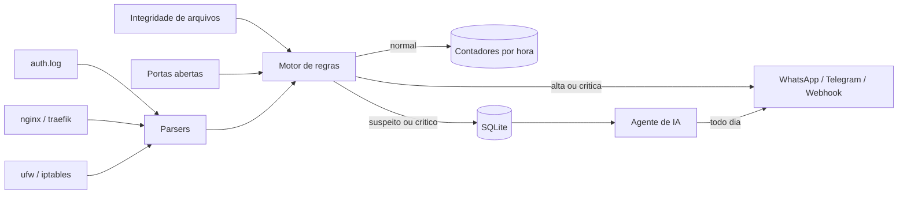

# Atalaia

**Monitoramento de segurança leve para VPS e servidores de pequenas e médias empresas.**

O Atalaia lê os logs do servidor em tempo real, classifica cada evento como `normal`, `suspeito` ou `critico`, avisa no WhatsApp ou Telegram quando algo grave acontece e entrega todo dia um relatório escrito por IA, em português, que qualquer dono de empresa entende.

Ele nasceu da ideia de juntar o melhor de duas ferramentas consagradas em algo que caiba em uma VPS de 1 GB:

1. Do **Wazuh**: regras de host, monitoramento de integridade de arquivos e mapeamento para o MITRE ATT&CK.
2. Do **Security Onion**: visão de rede e caça a ameaças.

Sem Elasticsearch, sem Java, sem banco externo. Só Python 3.9 ou superior.

## Sumário

1. [Por que o Atalaia existe](#por-que-o-atalaia-existe)
2. [Como funciona](#como-funciona)
3. [O que ele detecta](#o-que-ele-detecta)
4. [Instalação](#instalação)
5. [Primeiros passos](#primeiros-passos)
6. [Diagnóstico offline](#diagnóstico-offline)
7. [Agente de IA](#agente-de-ia)
8. [Notificações](#notificações)
9. [Configuração](#configuração)
10. [Criando regras](#criando-regras)
11. [Desempenho](#desempenho)
12. [Segurança do próprio agente](#segurança-do-próprio-agente)
13. [Desenvolvimento](#desenvolvimento)
14. [Perguntas frequentes](#perguntas-frequentes)
15. [Limitações e roadmap](#limitações-e-roadmap)

## Por que o Atalaia existe

Pequenas empresas têm servidores expostos na internet recebendo centenas de tentativas de invasão por dia, e ninguém olhando. As ferramentas profissionais existem e são gratuitas, mas o custo real não é a licença:

| | Wazuh | Security Onion | Atalaia |
|---|---|---|---|
| RAM recomendada | 4 GB ou mais | 12 GB ou mais | 30 MB |
| Tempo de instalação | Horas | Máquina dedicada | 1 comando |
| Dependências | Várias | Distribuição inteira | Só Python |
| Precisa de analista para ler | Sim | Sim | Não, a IA escreve o relatório |
| Alerta no WhatsApp | Por integração | Por integração | Nativo |

O Atalaia não substitui essas ferramentas em ambiente corporativo. Ele atende quem hoje não tem nada.

## Como funciona



1. **Coleta:** acompanha os arquivos de log como um `tail -f`, guardando a posição no banco. Sobrevive a reinício e a rotação de logs.
2. **Normalização:** cada linha vira um evento padronizado com IP, usuário, caminho, status e demais campos.
3. **Classificação:** o evento passa por 23 regras. Se nenhuma dispara, é `normal` e vira só um contador. Se dispara, é `suspeito` ou `critico` e fica gravado.
4. **Alerta:** severidade alta ou crítica gera notificação imediata, com limite anti enxurrada.
5. **Relatório:** uma vez por dia, o agente de IA resume o período e sugere ações.

## O que ele detecta

| Área | Detecções |
|---|---|
| SSH | Força bruta, enumeração de usuários, login direto como root, **login com sucesso depois de força bruta**, login de origem nunca vista |
| Sistema | Criação de usuário, entrada em grupo sudo, wheel ou docker, sudo com comandos de pós exploração, falhas repetidas de sudo |
| Web | Busca por `.env` e `.git`, SQL injection, XSS, Log4Shell, path traversal, varredura de diretórios, força bruta em painel, scanners conhecidos, **arquivo sensível exposto com status 200** |
| Rede | Varredura de portas via logs do firewall, nova porta aberta para a internet |
| Integridade | Alteração em `authorized_keys`, `passwd`, `shadow`, `sudoers`, cron, serviços systemd, `sshd_config` e `ld.so.preload` |

Todas as regras têm técnica do MITRE ATT&CK e uma recomendação do que fazer. Liste com `atalaia rules`.

### Como ele reduz falso positivo

1. **Aprendizado:** nas primeiras 24 horas, regras do tipo "nunca visto" apenas aprendem o que é normal no servidor.
2. **Agrupamento:** um scanner que dispara 500 vezes gera 1 alerta com contador 500.
3. **Limite de mensagens:** no máximo 10 notificações a cada 5 minutos por servidor.
4. **Ajuste sem código:** whitelist de IPs e faixas, desligar regras e mudar limites direto no `config.json`.

## Instalação

Requisitos: Linux com systemd, Python 3.9 ou superior e acesso root.

```bash
git clone https://github.com/Odiveighar/atalaia.git
cd atalaia
sudo bash deploy/install.sh
```

O instalador:

1. Copia o agente para `/opt/atalaia`.
2. Cria a configuração em `/etc/atalaia/config.json`.
3. Registra o serviço no systemd com limite de 96 MB de RAM e 20% de CPU.
4. Inicia o monitoramento e roda `atalaia check`.

Para remover: `sudo bash deploy/uninstall.sh`. Configuração e dados são mantidos.

### Traefik em Docker ou Docker Swarm

O Traefik manda o access log para o stdout por padrão. Para o Atalaia ler, grave em arquivo:

```yaml
command:
  - "--accesslog=true"
  - "--accesslog.filepath=/var/log/traefik/access.log"
volumes:
  - /var/log/traefik:/var/log/traefik
```

### Sistemas sem auth.log

Algumas distribuições recentes guardam os logs só no journald. Instale o rsyslog:

```bash
sudo apt install -y rsyslog
```

## Primeiros passos

```bash
atalaia check          # valida configuracao, fontes de log e chave da IA
atalaia status         # resumo das ultimas 24 horas
atalaia alerts         # alertas recentes
atalaia alerts --min alta --hours 48
atalaia report         # gera o relatorio agora
atalaia report --send  # gera e envia nos canais configurados
atalaia rules          # lista regras e se estao ativas
atalaia test-notify    # testa os canais de notificacao
journalctl -u atalaia -f
```

## Diagnóstico offline

Analisa logs de qualquer servidor **sem instalar nada nele**. Ideal para avaliar um ambiente antes de uma instalação ou para investigar um incidente que já aconteceu.

```bash
python3 -m atalaia analyze auth:auth.log http:access.log firewall:ufw.log --report
```

Formato dos argumentos: `tipo:caminho`, com os tipos `auth`, `http` e `firewall`.

O repositório traz logs de exemplo que simulam uma invasão completa. Teste agora:

```bash
python3 -m atalaia analyze auth:samples/auth.log
```

Saída real:

```
Eventos: 10 normais, 5 suspeitos, 1 criticos

24/09 03:14:40  CRITICA  SSH-004  x1    203.0.113.10   Login SSH com sucesso apos forca bruta
    Login SSH aceito (password) para root vindo de 203.0.113.10
24/09 03:12:14  ALTA     SSH-001  x8    203.0.113.10   Forca bruta SSH
    Falha de login SSH para root vindo de 203.0.113.10
24/09 03:15:02  ALTA     SYS-001  x1    -               Novo usuario criado no sistema
    Novo usuario criado no sistema: suporte
24/09 03:15:05  ALTA     SYS-002  x1    -               Usuario adicionado a grupo privilegiado
    Usuario suporte adicionado ao grupo sudo
```

O atacante tentou senhas, entrou como root, criou um usuário de persistência e deu sudo para ele. O Atalaia reconstruiu a cadeia inteira.

## Agente de IA

Com a IA ativada, o Atalaia:

1. **Escreve o relatório diário** com resumo executivo, nível de risco (baixo, moderado, alto ou crítico), incidentes em ordem de gravidade, prováveis falsos positivos com o ajuste sugerido e até 5 recomendações com o comando exato.
2. **Explica alertas críticos na hora**, em até 4 linhas, junto com a notificação.

Privacidade: a IA **nunca recebe logs brutos**, apenas o resumo agregado do período. Isso protege os dados e mantém o custo baixo.

Sem IA, o relatório continua sendo gerado em formato objetivo. O Atalaia nunca depende de serviço externo para proteger o servidor.

Para ativar:

```bash
sudo nano /etc/atalaia/env          # ANTHROPIC_API_KEY=sua_chave
sudo nano /etc/atalaia/config.json  # "ai": {"enabled": true}
sudo systemctl restart atalaia
atalaia check
```

## Notificações

Configure na seção `notify`. Dá para usar vários canais ao mesmo tempo.

| Canal | Campos |
|---|---|
| Telegram | `bot_token`, `chat_id` |
| WhatsApp via Evolution API | `url`, `instance`, `apikey`, `number` |
| Webhook | `url`, recebe JSON com o alerta completo |

Exemplo de alerta recebido:

```
[ATALAIA] ALERTA CRITICA
Servidor: vps-cliente
Regra: SSH-004 Login SSH com sucesso apos forca bruta
IP de origem: 203.0.113.10
Usuario: root
MITRE ATT&CK: T1110, T1078
Detalhe: Login SSH aceito (password) para root vindo de 203.0.113.10
O que fazer: Possivel invasao. Encerrar sessoes ativas, trocar senhas, revisar authorized_keys, crontab e usuarios criados, e bloquear o IP.
```

## Configuração

Arquivo: `/etc/atalaia/config.json`. Tudo que não for informado usa o valor padrão.

| Campo | Padrão | Descrição |
|---|---|---|
| `host_name` | nome da máquina | Nome que aparece nos alertas |
| `data_dir` | `/var/lib/atalaia` | Banco e relatórios |
| `poll_interval` | `2` | Segundos entre leituras dos logs |
| `learning_hours` | `24` | Período de aprendizado das regras "nunca visto" |
| `whitelist_ips` | `127.0.0.1`, `::1` | IPs ou faixas CIDR ignorados pelas regras |
| `sources` | auth, nginx, traefik, ufw | Lista de `{"type", "path"}` |
| `fim.paths` | arquivos críticos do sistema | Arquivos vigiados, aceita curingas |
| `fim.interval` | `300` | Segundos entre verificações de integridade |
| `network.interval` | `60` | Segundos entre verificações de portas |
| `retention` | 14, 90 e 90 dias | Retenção de eventos, alertas e estatísticas |
| `rules_disabled` | vazio | IDs de regras desligadas |
| `rules_override` | vazio | Mudanças por regra, exemplo `{"SSH-001": {"count": 15}}` |
| `rules_extra` | vazio | Caminho de um JSON com regras próprias |
| `ai.enabled` | `false` | Liga o agente de IA |
| `ai.model` | `claude-haiku-4-5-20251001` | Modelo usado |
| `ai.report_hour` | `7` | Hora do relatório diário |
| `ai.explain_critical` | `true` | Explicação por IA nos alertas críticos |
| `ai.company_name` | vazio | Nome da empresa no relatório |
| `notify.min_severity` | `alta` | Severidade mínima para notificar |
| `notify.max_per_5min` | `10` | Limite de mensagens |

## Criando regras

Crie um arquivo JSON e aponte o caminho em `rules_extra`.

| Tipo | Quando dispara |
|---|---|
| `match` | O evento bate com as condições |
| `threshold` | `count` eventos do mesmo grupo dentro de `window` segundos |
| `distinct` | O mesmo grupo gera `count` valores diferentes do campo `distinct` |
| `new_value` | A combinação dos campos `keys` aparece pela primeira vez |
| `sequence` | A regra indicada em `requires.rule` já disparou para a mesma chave |

Condições em `match` e `exclude` são expressões regulares sem diferenciar maiúsculas. O campo `etype` aceita um tipo ou lista de tipos.

Tipos de evento: `ssh_fail`, `ssh_success`, `ssh_invalid_user`, `sudo`, `sudo_fail`, `user_created`, `group_add`, `http`, `fw_block`, `fim_change`, `net_listen`.

Exemplo, alertar todo acesso bem sucedido ao painel administrativo:

```json
[
  {
    "id": "CLI-001",
    "title": "Acesso ao painel administrativo",
    "kind": "match",
    "severity": "media",
    "mitre": "T1078",
    "match": {"etype": "http", "path": "^/admin", "status": "^200$"},
    "group_by": "ip",
    "recommendation": "Confirmar se o acesso foi feito por alguem da equipe."
  }
]
```

## Desempenho

Medido com 200 mil linhas de log HTTP, em um único núcleo:

| Métrica | Resultado |
|---|---|
| Vazão | cerca de 28 mil linhas por segundo |
| Pico de RAM | 23 MB |
| RAM em operação contínua | 25 a 30 MB |
| Banco após o teste | 60 KB |

O banco fica pequeno porque eventos normais não são gravados um a um, apenas contados por hora.

## Segurança do próprio agente

Uma ferramenta de segurança não pode virar porta de entrada. Por isso o serviço roda com:

1. `ProtectSystem=strict`: todo o sistema é somente leitura para o agente, exceto `/var/lib/atalaia`.
2. `NoNewPrivileges` e `PrivateTmp`.
3. Nenhuma porta aberta: o Atalaia não escuta conexões, só envia.
4. Configuração e chave da API com permissão `600`.
5. Zero dependências de terceiros, o que elimina risco de cadeia de suprimentos.

## Desenvolvimento

```
atalaia/
  agent.py        loop principal
  collectors.py   leitura de logs, integridade de arquivos, portas
  parsers.py      normalizacao de logs
  engine.py       motor de regras e classificacao
  rules/          regras padrao com MITRE ATT&CK
  storage.py      SQLite
  report.py       relatorio diario
  ai.py           agente de IA
  notify.py       Telegram, WhatsApp e webhook
deploy/           instalador, desinstalador e servico systemd
samples/          logs de exemplo
scripts/          checagens de estilo
tests/            testes automatizados
docs/             plano de produto e roadmap
```

Rodar localmente sem instalar:

```bash
python3 -m unittest discover -s tests -v
python3 scripts/checar_estilo.py
python3 -m atalaia analyze auth:samples/auth.log http:samples/access.log firewall:samples/ufw.log --report
```

O GitHub Actions roda os testes em Python 3.9, 3.10 e 3.12 a cada push.

Padrões do código:

1. Somente biblioteca padrão do Python.
2. Sem travessão e sem emoji em código, documentação e mensagens. O CI reprova se encontrar.
3. Toda regra nova precisa de técnica MITRE, recomendação e um teste.

## Perguntas frequentes

**Preciso parar algum serviço para instalar?**
Não. O Atalaia só lê logs e arquivos. Nada no servidor é alterado.

**Ele bloqueia ataques?**
Nesta versão ele detecta e avisa. O bloqueio automático de IP está previsto para a v0.3. Até lá, combine com fail2ban ou CrowdSec.

**E se a VPS tiver pouca memória?**
O systemd limita o Atalaia a 96 MB. Em uso normal ele fica em torno de 30 MB.

**Os alertas vão me inundar?**
Não. Alertas repetidos são agrupados e existe limite de mensagens por janela de tempo.

**Funciona sem internet?**
Sim. Detecção, banco e relatório sem IA funcionam offline. Só notificações e IA precisam de rede.

**Onde ficam os relatórios?**
Em `/var/lib/atalaia/relatorios/`, um arquivo por dia, além do envio pelos canais configurados.

## Limitações e roadmap

Limitações conhecidas desta versão:

1. A visão de rede usa logs do firewall e portas abertas. Não inspeciona pacotes como o Suricata.
2. Linhas escritas no arquivo antigo no exato momento da rotação podem ser perdidas.
3. Ainda não lê o journald nem logs de containers diretamente.
4. Uma instalação monitora um servidor.

Próximas versões:

| Versão | Foco |
|---|---|
| v0.2 | Painel central com vários clientes e servidores, relatório mensal em PDF, alerta de agente offline |
| v0.3 | Bloqueio automático de IP, listas de reputação, leitura de journald e Docker |
| v0.4 | Integração opcional com Suricata, verificação de pacotes vulneráveis, nota de segurança por servidor, IA conversacional pelo WhatsApp |

Detalhes em [`docs/PLANO_MVP.md`](docs/PLANO_MVP.md).

## Autor

Desenvolvido por **Odivan Souza**, analista de automação e cibersegurança.

[LinkedIn](https://www.linkedin.com/in/odivan-souza/) | [GitHub](https://github.com/Odiveighar) | [TryHackMe](https://tryhackme.com/p/Odiveighar)

## Contribuindo

Contribuições são bem-vindas, principalmente regras novas, parsers para outros formatos de log e relatos de falso positivo. Leia o [`CONTRIBUTING.md`](CONTRIBUTING.md) antes de abrir um pull request.

Encontrou uma vulnerabilidade no próprio Atalaia? **Não abra issue pública.** Siga o [`SECURITY.md`](SECURITY.md).

## Licença

Distribuído sob a licença Apache 2.0. Veja o arquivo [`LICENSE`](LICENSE).
